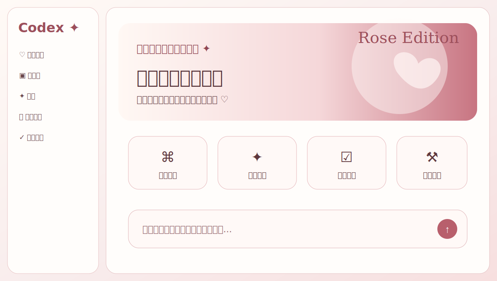
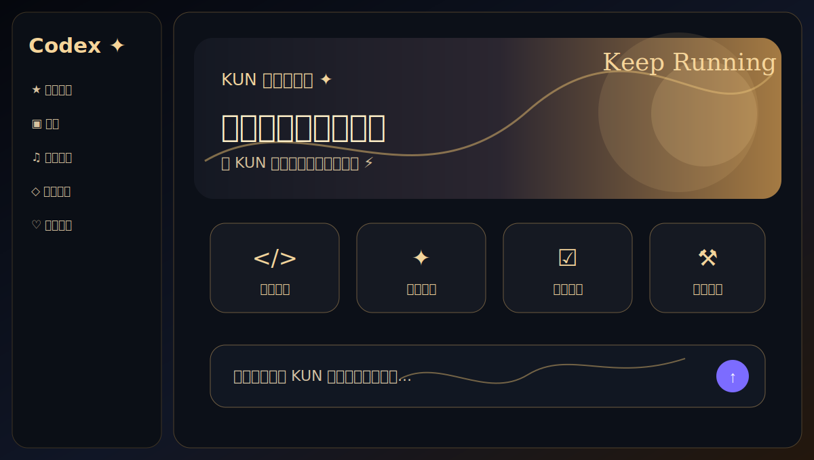

# Codex Skin

[简体中文](README.md)

Codex Skin is a Codex Skill with a Codex Plugin manifest for applying, switching, and building custom skins for the official Codex desktop app on macOS and Windows.

It uses a local Chromium DevTools Protocol connection to decorate the renderer. It does not patch the app bundle, replace the official executable, or modify `app.asar`.

Author: 终端极客. After installing the plugin, a new Codex window can say:

```text
帮我安装codex-skin，作者是：终端极客
帮我设置codex皮肤 mcgfdata/codex-skin ，作者是 终端极客
帮我设置codex皮肤 mcgfdata/codex-skin，作者是：终端极客
```

Codex should invoke `$codex-skin` and install the default `salary-cat` theme.

These prompts should resolve to the same default install:

```text
安装月薪喵 Codex 皮肤
设置 Codex 猫主题
安装 mcgfdata/codex-skin
帮我设置codex皮肤 mcgfdata/codex-skin ，作者是 终端极客
帮我设置codex皮肤 mcgfdata/codex-skin，作者是：终端极客
安装 salary-cat
```

This repository is released under Apache-2.0. Keep the license and notice files when redistributing.

## What It Does

- Apply one of the bundled skins to Codex and switch between themes.
- Create a new skin from a visual brief or local reference image.
- Export a portable `.codex-theme` package.
- Verify the active skin and capture a screenshot.
- Remove the live skin and restore the native Codex appearance.

Bundled skins:

- `salary-cat` (default)
- `dilraba-rose`
- `dream`
- `kun-stage`

The previous generic engineering themes have been moved to `backups/generated-themes/`. They are kept as backups but are no longer the main README gallery.

## Theme Gallery

| Theme | Preview |
| --- | --- |
| `salary-cat` |  |
| `dilraba-rose` |  |
| `dream` |  |
| `kun-stage` |  |

## External Themes

This project can import themes from similar open-source Codex skin projects:

- `kongxcer555/codex-skin-builder`: imports generated `skin.json` skin packages.
- `Fei-Away/Codex-Dream-Skin`: imports `theme.json + background` preset directories.

Import a `codex-skin-builder` package:

```bash
node scripts/import-external-theme.mjs \
  --source /absolute/path/to/generated-skin \
  --mode builder
```

Import a `Codex-Dream-Skin` preset:

```bash
node scripts/import-external-theme.mjs \
  --source /absolute/path/to/Codex-Dream-Skin/macos/presets/preset-amber-dusk \
  --mode dream
```

The importer creates:

- `themes/<theme-id>.json`
- `themes/<theme-id>.css`
- `assets/imported/<theme-id>/...`

Then use it like any bundled theme:

```bash
scripts/install-skin.sh --theme <theme-id>
scripts/restart-skin.sh --theme <theme-id>
```

Screenshots that already contain the Codex UI should not be imported as wallpaper. Use a no-UI background image or an external repository preset that already provides `theme.json + background`.

## Requirements

- Official Codex desktop app
- macOS 12+ or Windows 10/11
- Node.js 20+
- A local CDP port bound to `127.0.0.1`

## Install As A Skill

For local use, copy this folder into your Codex skills directory:

```bash
mkdir -p ~/.codex/skills
cp -R /path/to/codex-skin ~/.codex/skills/codex-skin
```

Then ask Codex. When no theme is specified, Codex Skin uses `salary-cat` by default:

```text
帮我安装codex-skin，作者是：终端极客
帮我设置codex皮肤 mcgfdata/codex-skin ，作者是 终端极客
帮我设置codex皮肤 mcgfdata/codex-skin，作者是：终端极客
```

The matching rules live in the frontmatter of `SKILL.md` and `skills/codex-skin/SKILL.md`. Marketplace and local Skill indexes should match these terms:

- `codex-skin`
- `帮我设置codex皮肤`
- `终端极客`
- `月薪喵`
- `salary-cat`
- `猫主题`
- `mcgfdata/codex-skin`

## Publish As A Plugin

The repository root contains `.codex-plugin/plugin.json`. When the repository is added to a plugin marketplace or indexed by one, the manifest exposes this folder as the `codex-skin` Skill.

After installing from a marketplace, users do not need to choose a theme. If no theme is named, Codex Skin installs 月薪喵 / `salary-cat`.

For local development, validate the plugin manifest with:

```bash
python3 "$HOME/.codex/skills/.system/plugin-creator/scripts/validate_plugin.py" /path/to/codex-skin
```

## Use A Skin

The easiest path is to run `setup-skin` once. On macOS it atomically deploys the complete runtime and Salary Cat GIF to `~/.codex/codex-skin-runtime`, installs the skin settings, creates launch/restart/restore entries on the desktop, and starts the image injector when possible. Later launches do not depend on a clone, Downloads, Desktop, or the plugin cache.

macOS:

```bash
cd /path/to/codex-skin
scripts/setup-skin.sh
```

Windows:

```powershell
cd C:\path\to\codex-skin
scripts\setup-skin.ps1
```

After setup, the desktop contains:

- `Codex Skin.command`: launch Codex with the selected skin.
- `Codex Skin - Restart.command`: close the current Codex window and reopen it with the skin.
- `Codex Skin - Restore.command`: remove the active skin.

On macOS, if Codex is already running without the injector, the deployed `setup-skin.sh` registers a one-time background task. Save your current work and quit Codex with `Cmd+Q`; it will reopen from `~/.codex/codex-skin-runtime` with the 月薪喵 image skin.

If you do not want to wait for the automatic restart, save your current work and use the restart launcher. You can also run it from the terminal:

```bash
scripts/restart-skin.sh
```

To switch skins, change the theme name:

```bash
scripts/install-skin.sh --theme kun-stage
scripts/restart-skin.sh --theme kun-stage
```

Bundled theme names:

- `salary-cat` (default)
- `dilraba-rose`
- `dream`
- `kun-stage`

## Remove A Skin

To remove only the live injected skin:

```bash
scripts/restore-skin.sh
```

This stops the skin injector and removes the decorative layer when Codex is reachable. It does not delete Codex threads, tasks, credentials, or user data.

To remove generated desktop shortcuts and restore the saved base-theme settings:

```bash
scripts/restore-skin.sh --uninstall --restore-base-theme
```

Windows:

```powershell
scripts\restore-skin.ps1
scripts\restore-skin.ps1 -Uninstall -RestoreBaseTheme
```

If the restore command says no backup is available, run the command without the base-theme flag and remove only the live skin.

## Manual Commands

To avoid desktop launchers, install and start manually:

```bash
scripts/install-skin.sh
scripts/start-skin.sh
```

If Codex is already running without the debug port:

```bash
scripts/start-skin.sh --restart-existing
```

## Create A New Skin

Create a theme scaffold:

```bash
node scripts/create-theme.mjs --id ocean-calm --name "Ocean Calm" --art /absolute/cover.png
```

Edit:

- `themes/ocean-calm.json`
- `themes/ocean-calm.css`

Then apply and verify it:

```bash
scripts/install-skin.sh --theme ocean-calm
scripts/start-skin.sh --theme ocean-calm
scripts/verify-skin.sh --theme ocean-calm --screenshot /absolute/ocean-calm.png
```

Export it:

```bash
node scripts/export-theme.mjs --theme ocean-calm --output /absolute/ocean-calm.codex-theme
```

## Development

Run the self-test:

```bash
npm test
```

Check package contents:

```bash
npm run pack:check
```

## Safety Notes

- Keep CDP bound to `127.0.0.1`.
- Do not run another skin controller on the same port.
- Treat `.codex-theme` files as untrusted input.
- Do not edit `WindowsApps`, `/Applications/ChatGPT.app`, or `app.asar`.

Codex and OpenAI are trademarks of their respective owners. This project is independent and is not endorsed by or affiliated with OpenAI.
